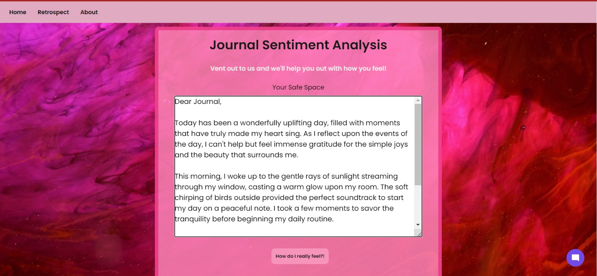
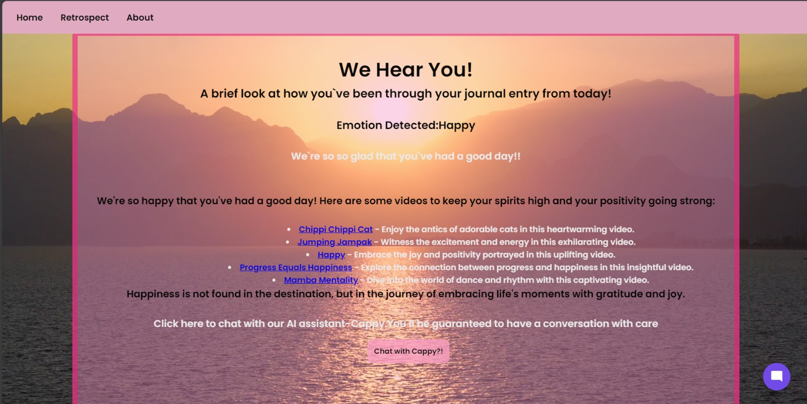
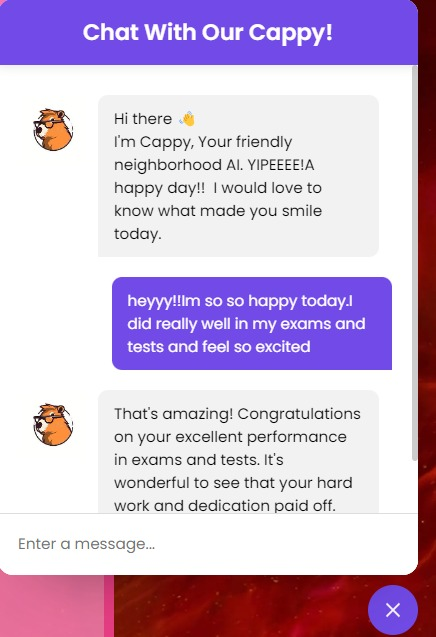
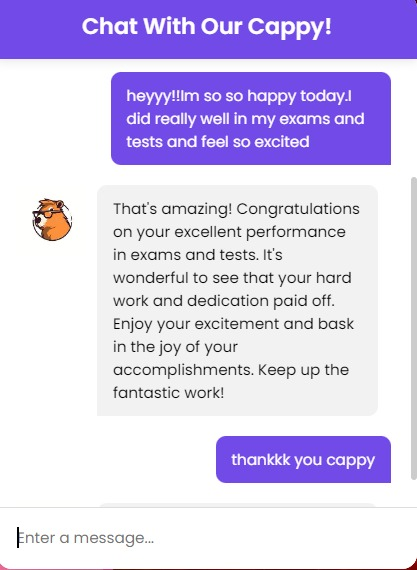
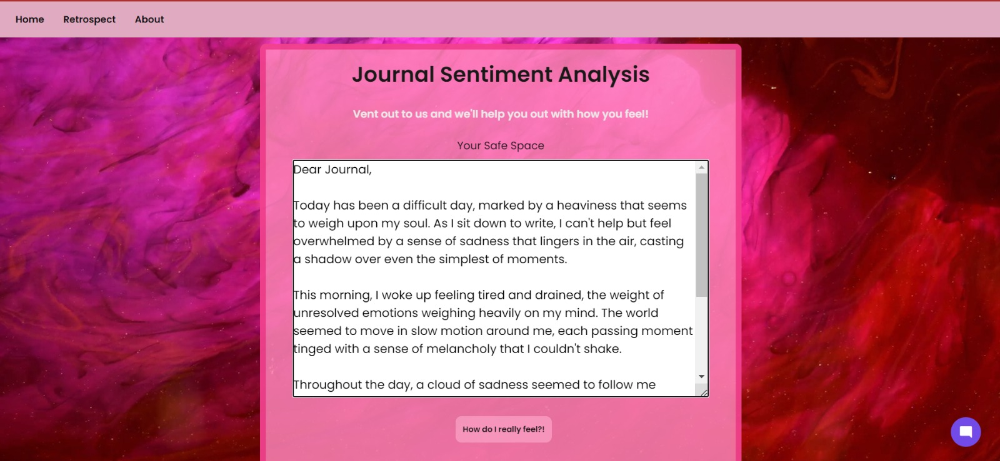
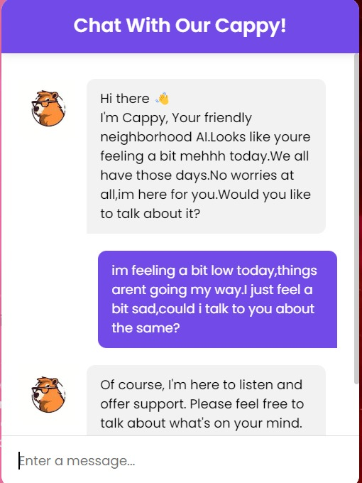
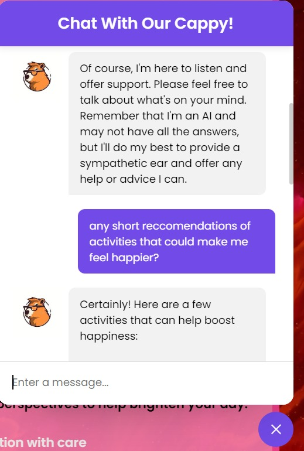
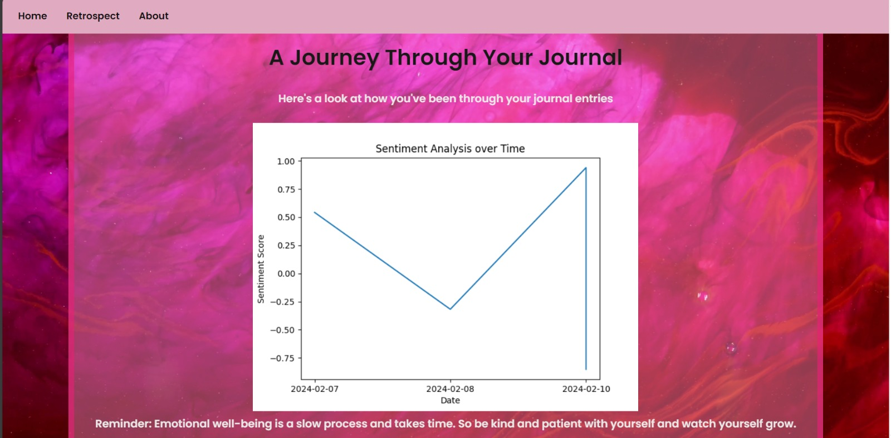
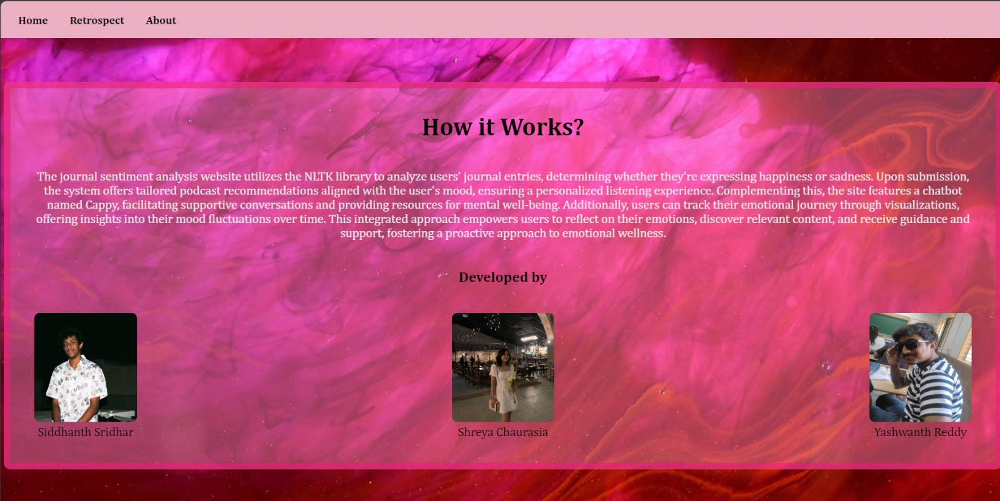

README.md

# Journal Sentiment Analysis Website

🌟 Welcome to our latest project: a journal sentiment analysis website! 📝💬

Our platform utilizes the NLTK library to analyze users' journal entries, deciphering their emotional tone, whether you're happy or sad. Upon submission, we curate personalized podcast recommendations tailored to match your mood, ensuring every listening experience hits the right note. 🎧✨ 

But that's not all! Meet Cappy, our friendly chatbot companion powered by OpenAI, here to lend a supportive ear and offer valuable resources for mental well-being. 💬🤖 

With intuitive visualizations, users can track their emotional journey, gaining invaluable insights into mood fluctuations over time. 📊💭 Our integrated approach empowers users to engage with their emotions, discover relevant content, and embark on a proactive journey toward emotional wellness. #EmotionalIntelligence

## Features🤩
- Frontend: HTML, CSS, JavaScript
- Chatbot: OpenAI integration
- Linked by Flask

## Special Features👀
- For happy journal entries, enjoy cheerful sounds like "chippi chippi chaapa chaapa"
- For low days, experience soothing sounds like "snowfall"

## Output Photos 📷

### Happy Entry 😁!

### Sad Entry 😓!

### Retrospect 🤔!

### About Us 👥!

## Contribution🤝🏻

- Siddhanth Sridhar(@sidd2305)
- Shreya Chaurasia(@shreyyasiaa)
- Yashwanth Reddy(@yashwanth05)
  
We welcome contributions from the community to enhance our platform.🚀 Happy journaling and emotional wellness exploration! 🚀
